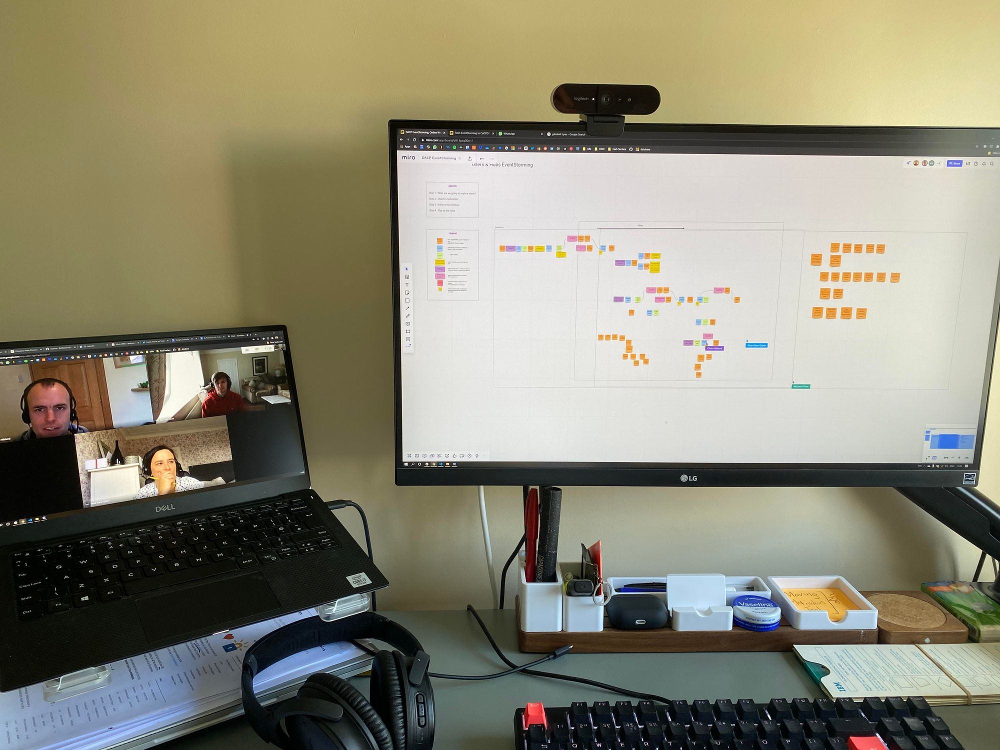

Eventstorming is a visual collaborative technique used to explore and understand complex systems and processes. It involves bringing together a diverse group of people and using storytelling to **discover the domain together**.  In a traditional eventstorming workshop, participants gather in a physical location to work together, but with the rise of remote work, it's becoming increasingly common to conduct eventstorming sessions remotely.

EventStorming has become the de-facto starting point for many Domain Driven Design practitioners.  It is an effective technique that spreads and shares domain knowledge through the team, thereby creating a **shared understanding**.  This in turn enables software developers to build a software system that aligns with the domain.

In a remote eventstorming workshop, participants join a virtual meeting and use a shared online whiteboard to collaborate and map out the flow of events. There are a few key considerations to keep in mind when conducting a remote eventstorming workshop:

1.  **Choose the right platform.** It's important to choose a platform that is easy to use and allows for real-time collaboration. My preference is Miro, however, Mural and Google Jamboard are other options.
2.  **Set clear goals and expectations.** Before the workshop, make sure to clearly communicate the goals and expectations for the session. This will help participants understand what is expected of them and how to prepare.
3.  **Create a welcoming and inclusive environment.** Remote workshops can be more challenging in terms of creating a sense of community and inclusivity. As a facilitator, make sure to create a welcoming and inclusive environment by being mindful of participants' needs and making sure that everyone's voice is heard.
4.  **Use breakout rooms.** To encourage collaboration and idea-sharing, consider using breakout rooms to allow small groups to work together. This can help to foster a sense of community and encourage more active participation.

## What makes up an EventStorming session?

An eventstorming session typically has several key components:

1.  **The timeline.** The process is represented as a timeline of events, which are represented using sticky notes or other visual aids. The events are placed in chronological order, with the earliest event at the top and the latest event at the bottom.
2.  **The actors.** The actors involved in each event are identified and represented using different coloured sticky notes or other visual aids. Actors can include people, systems, or organizations.
3.  **The relationships and dependencies between events** The relationships and dependencies between events are represented using lines or arrows. This can help to identify areas of the process where there is a high degree of interaction or where one event is dependent on the completion of another event.
4.  **The questions.** Throughout the eventstorming session, the facilitator will ask questions to help the team explore the process in more detail. These questions can be used to identify bottlenecks, inefficiencies, and areas for improvement.
5.  **The improvement identification.** At the end of the eventstorming session, the team will identify the areas of the process that need improvement, and discuss potential solutions.
6.  **The follow-up action.** The improvement identified during the eventstorming session will be prioritized, and follow-up actions will be planned and assigned to specific individuals or teams.

## Learning is ongoing

Eventstorming is not just a one-time event, but rather a continuous effort. It involves a feedback loop, in which the Eventstorming sessions are followed by the implementation and testing of the identified improvements, followed by another round of Eventstorming to validate the changes and identify new areas for improvement.

## Resources

-   **EventStorming book:** [https://www.eventstorming.com/book/](https://www.eventstorming.com/book/)

## And finally

This thread from Stefan Spittank does a nice job of breaking down EventStorming:

> Finally I have time to learn more about domain driven design (DDD) and event storming.  
> To help me internalize it, I try to visualize my learnings. I will share these pictures here along the way.[#ddd](https://twitter.com/hashtag/ddd?src=hash&ref_src=twsrc%5Etfw) [#eventstorming](https://twitter.com/hashtag/eventstorming?src=hash&ref_src=twsrc%5Etfw)
> 
> — Stefan Spittank (@spittank) [March 31, 2020](https://twitter.com/spittank/status/1244991758011895813?ref_src=twsrc%5Etfw)
